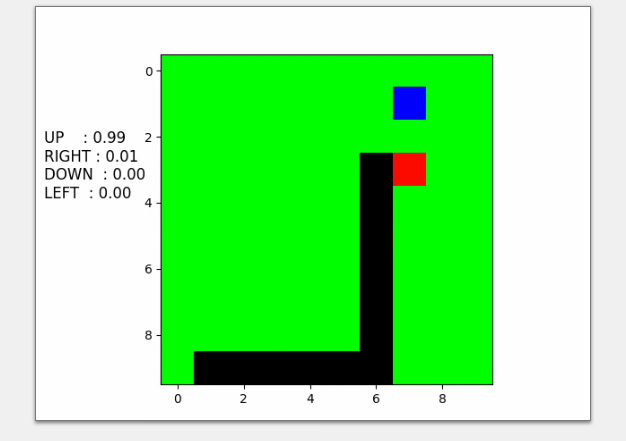

# gym-snake

Fork of [this repository](https://github.com/grantsrb/Gym-Snake). 

This repo includes a Pytorch implementation of Vanilla Policy Gradients following Andrej Karpathy's [tutorial](https://www.youtube.com/watch?v=tqrcjHuNdmQ). Code for PG supports environment with only one snake. In ~one day of training snake is able to get to length of ~25 on 10x10 map, but still sometimes plays episodes without picking any apple. 

## Dependencies
- pip
- gym
- numpy
- matplotlib

## Installation
1. Clone this repository
2. Navigate to the cloned repository
3. Run command `$ pip install -e ./`

For env details check original repo's [README](https://github.com/grantsrb/Gym-Snake/blob/master/README.md).

## Observation space

Comparing to the orginal environment, before passing observations to network, they are mapped to three channels:
1. Snake's head is 1 
2. Snake's body is marked with ones
3. Apple is 1
All the other values are zeroes. Probably standarization of the input would facilitate learning. Then the observations are flattened and passed to the network.

## Policy gradients

VanillaPG folder contains definition of network, policy and training loop. There are two network variants, the second one has additional hidden layer. There are two policy variants, in second there is added small negative reward for each snake's step. 

Two hidden layers get better results faster, negative reward is unnecessary when cutting too long episodes. For training use train_cut.py which includes termination of long episodes.
